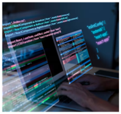

# 👋 이민구 GitHub Profile

안녕하세요. 개발을 배우고 있는 **이민구**입니다.  
현재 **C 언어와 Java**를 공부하며 프로젝트를 통해 문제 해결 경험을 쌓고 있습니다.
---
### 1. 이민구
   
- 2004년생
- 컴퓨터 공학 재학 중 (23학번)
- **인천** 거주
- [깃허브 주소](https://github.com/wn12093)
- 이메일 주소 / atom10150@gmail.com
 
현재 **C 언어 기반 프로그래밍 경험**이 있으며,  
객체지향 프로그래밍 이해를 위해 **Java를 학습 중**입니다.

----
### 2. 프로젝트
#### [Minesweeper](https://github.com/wn12093/minesweeper)
- **C 언어 기반 지뢰찾기 게임 구현**
- 콘솔 환경에서 동작하며 게임 로직과 배열 처리 경험

#### [Linux-quiz](https://github.com/wn12093/Linux-quiz)
- **Claude를 활용한 Linux 학습 퀴즈 프로젝트**
- 리눅스 마스터 자격증 학습을 위한 문제 풀이 방식 구현

### 3. 기술 스택

#### Language  
  - C
  - Java (학습 중)

#### Tools & Collaboration
  - GitHub
  - Claude
 
### 목표

꾸준히 프로젝트를 진행하며  
백엔드 및 소프트웨어 개발 역량을 성장시키고 있습니다.
